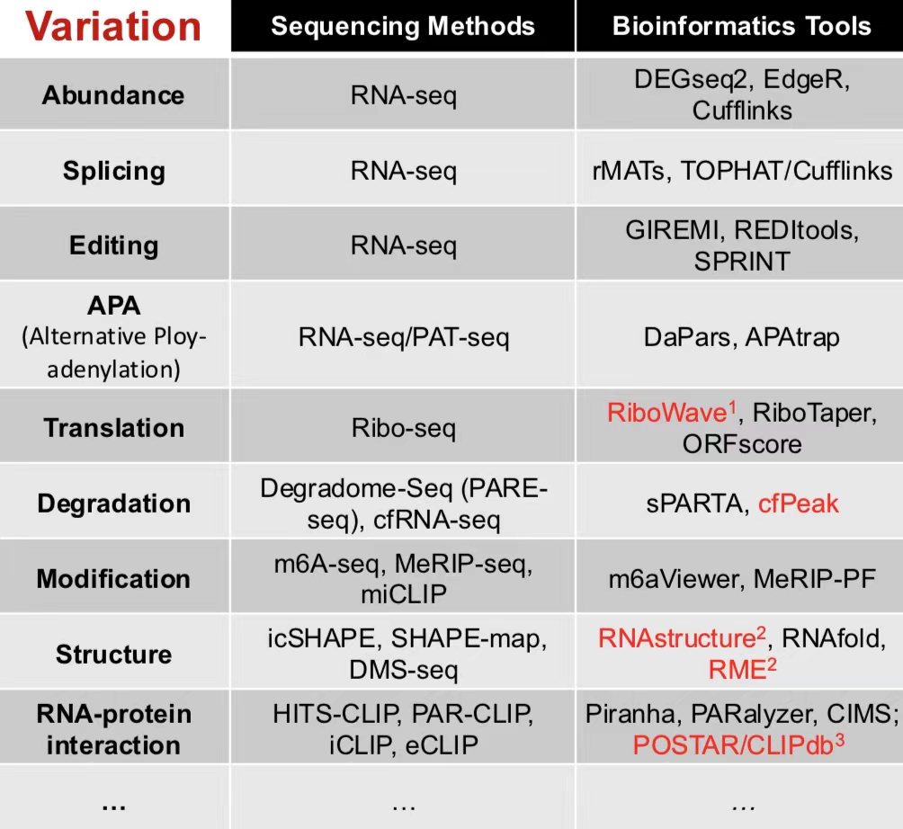

# 生物信息学实践 9.13
## Course Logistic
### 预修课程
微积分、概率论、物化......
### 后续课程
Python相关、AI相关
### 学习内容和方法
#### 参考资料
- 主要：
  - [上课讲义](https://cloud.tsinghua.edu.cn/d/7b9e077b79a94f82b2d7/)
  - [实践教程](https://book.ncrnalab.org/teaching)
- 其他：
  - 参考书
  - 在线搜索
  - 在线课程
#### 学习内容
- Linux(week1-4)
- R/Python(week5-16)
#### 学习方法
- In-class + After-class
- 构建学习和实践的框架
- 自主学习编程技巧（**Bioinformatics Data Skills**）
### 评分机制
- 20%课堂互动
- 80%作业（建议和反馈加分）
- 加分题（学期末）
### 答疑时间
课前（教师）课后（助教）
## Introduction of Bioinformatics
### 4 steps
> Question->Information->Analysis->Modeling
### Question(问题)
Science? Technology? Philosophy?
### Information(信息)
**NGS(Next Generation Sequecing)**: 测序能力革命性的提升
> **1**(HGP)->**4,000,000,000** per year
> 
> **Big** and **HD** data
> 
> **Metagenomic**
1. DNA-seq
2. RNA-seq
3. Epigenetics
   - DNAase
   - Methylation
   - Histone modifications: ChIP-seq
4. Interaction
   - ChIP-seq(*Protein-DNA*)
   - CLIP-seq(*Protein-RNA*)
   - Grid-seq(*DNA-RNA*)
### Analysis(分析)
- Sequecing method + bioinformatics tool
> Different RNA variations should match different sequencing methods and bioinformatics tools
>
> 
- Data interpretation
> Cell types/Gene signatures
### Modeling(建模)
#### Probabilistic Model
- Machine learning
  -Regression 
  > Linear regression -> Logistic regression
- Deep learning 
  > Neural network model
- ......
  > 

#### Computational Algorithm

